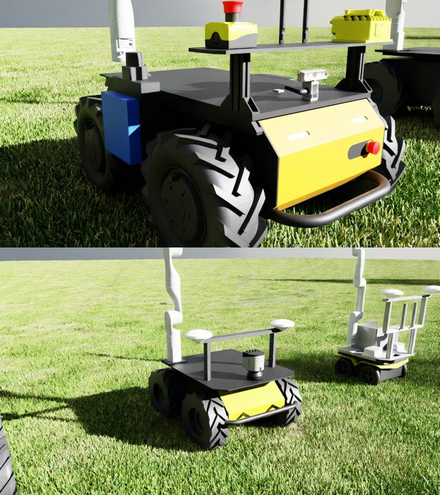
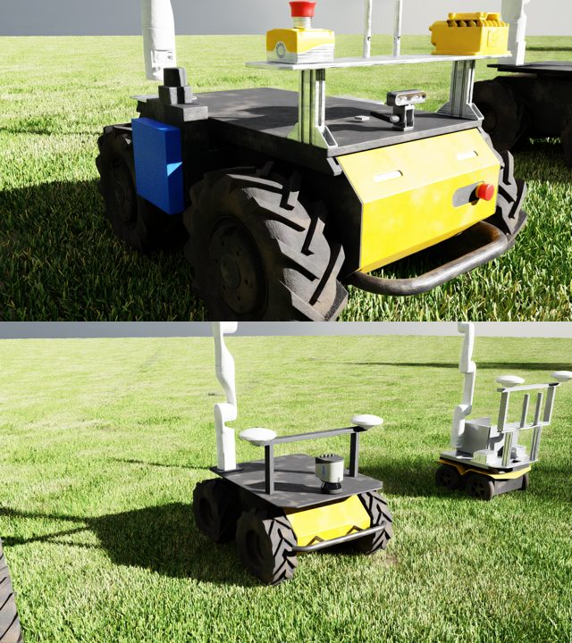
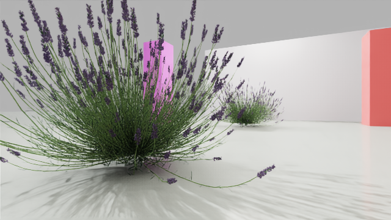
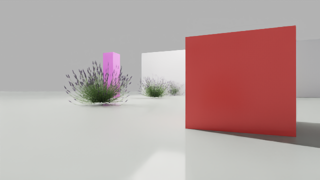

# Clearpath fleet in Isaac Sim

A configurable number (0–8, three if `.env` doesn't say otherwise) of Clearpath robots simulated in NVIDIA Isaac Sim 6.0 and driven over ROS 2 Jazzy. Each robot slot independently runs one of four generic Clearpath models — A300, A200, Jackal (`j100`) or Ridgeback (`r100`), each with a RealSense D435i facing forward — or one of MTU's real robots with its own sensors and Kinova arm (`j100_0921`, `a200_0284`, `a300_00036`, ...), so the fleet can be a single model or a mix; see *Number of robots*.

- **Isaac Sim** runs in one container and is streamed to you over WebRTC, or shows its own desktop window with `SIM_MODE=headed` (needs `scripts/x11_auth.sh`; the headed app takes ~3 min to start).
- **Each robot** has its own ROS 2 container, standing in for the robot's onboard computer. It talks to the sim over a private Docker network, as a real robot would over a LAN. The middleware is `rmw_zenoh_cpp` (as on the real robots, through a `zenoh-router` container) or Fast DDS; see *Middleware*.
- Inside a robot container you can view the camera, drive with the keyboard, open RViz and run a Foxglove bridge.

```
                 ┌──────────────────── docker network "ros" (rmw_zenoh_cpp via zenoh-router, or FastDDS) ────┐
 WebRTC client ──┤ isaac-sim  (N robots, each A300/A200/Jackal/Ridgeback + D435i, ROS 2 bridge)                │
 49100/tcp       │    ▲ cmd_vel        │ odom, joint_states, tf, camera images                                │
 47998/udp       │    │                ▼                                                                      │
                 │ a300_0000   j100_0921   ...        ← robot_state_publisher, EKF, teleop, RViz, foxglove    │
                 └────────────────────────────────────────────────────────────────────────────────────────────┘
                                8765         8766       (N = NUM_ROBOTS, Foxglove WebSocket on 8765 + slot index)
```

## Requirements

- Linux with an NVIDIA GPU, a recent driver and the [NVIDIA Container Toolkit](https://docs.nvidia.com/datacenter/cloud-native/container-toolkit/) (tested on an RTX 4080 SUPER)
- Docker with the Compose plugin
- Access to the Isaac Sim image `nvcr.io/nvidia/isaac-sim:6.0.0` (`docker login nvcr.io` with an NGC API key)
- An X11 desktop (for `camera_view` and RViz windows) and `xauth`
- The Isaac Sim WebRTC Streaming Client (NVIDIA's desktop app, see the Isaac Sim livestream docs) to see the simulation

## Quick start

```bash
# 0. Get the code, including the ROS packages in colcon_ws/src (several are git submodules)
git clone --recurse-submodules https://github.com/robotian/multirobot_sim.git
cd multirobot_sim          # existing clone instead: git submodule update --init --recursive

# 1. Log in to NVIDIA's registry once (NGC API key); the Isaac Sim base image is pulled during the build
docker login nvcr.io

# 2. Build both images: clearpath-robot:jazzy (every robot + the zenoh router) and a300-isaac-sim:6.0.0
docker compose build

# 3. Generate the robot descriptions (URDF + meshes -> sim/assets/); needs the robot image from step 2
scripts/gen_urdf.sh

# 4. Allow the containers to open windows on your display (once per login)
scripts/x11_auth.sh

# 5. Start the sim with the scene (no robots yet), then spawn the robots chosen in .env (NUM_ROBOTS,
#    ROBOT_MODEL_<i>; see "Number of robots") into it and start their containers -- or do both with `scripts/fleet.sh`
scripts/fleet.sh scene      # waits until the scene is ready (~40 s streaming, ~3 min headed)
scripts/fleet.sh spawn 2    # 2 robots at the default poses; --poses '[{"x":0,"y":0,"yaw":90}, ...]' to choose them
docker compose logs -f isaac-sim     # the sim's own lines start with [fleet]

# 6. Build the shared ROS workspace colcon_ws/src in the running robot containers (first time, and after editing packages)
scripts/colcon_build.sh
```

Notes:

- **Use `scripts/fleet.sh`, not a bare `docker compose up -d`, to start and to change the robots:** the sim only spawns robots when it gets a spawn request (which `fleet.sh spawn` and the web UI write), and the script keeps the per-slot container names and hostnames in `.env` in sync and removes robot containers you no longer want. A bare `docker compose up -d` starts the sim and robot containers but spawns no robots unless a request from before is still there.
- `robot_data/` (the real MTU robots' own `robot.yaml` files) is not in git. Without them `gen_urdf.sh` still generates the four generic models (`a300`, `a200`, `j100`, `r100`); real-robot ids such as `j100_0921` only work once their `robot_data/<id>/robot.yaml` is present (see *Adding a real robot configuration file*).
- The first start is slow: Isaac Sim compiles shaders and imports the URDF to USD. Later starts reuse the caches. `sim/assets/` and `sim/generated/` are not in git; `scripts/gen_urdf.sh` and the first start create them, so run the script after every fresh clone.
- Then open the WebRTC Streaming Client and connect to `ISAACSIM_HOST` (from `.env`; use `127.0.0.1` when it runs on the same machine).
- Optional: `python3 tools/sim_ui/server.py` serves a local web UI on <http://127.0.0.1:8090> to start/stop/reset the sim, spawn robots at poses you choose (number fields or a click on its top-down map), run `sim_robot_upstart`, move the arm and start/stop `cut_stem`. **Start** loads the scene only; pick the robots and their poses, then **Spawn**.

Stop everything with `scripts/stop_sim.sh` (plain `docker compose down` misses robot services outside the active `NUM_ROBOTS` profile).

### Rebuilding after a change

Which command you need depends on what you edited. Nothing else is baked into an image.

| You changed | Do this |
|---|---|
| `robot/Dockerfile`, `robot/entrypoint.sh`, `robot/bin/*` (`generate_srdf`, `robot_state`, `teleop`, ...), `robot/config/*.tmpl` | `docker compose build robot0`, then recreate the robots: `scripts/fleet.sh` (or `docker compose up -d --force-recreate <robot service>`). These files are copied into the image at build time. One build serves every slot: `robot0`..`robot7` share the tag `clearpath-robot:jazzy`. |
| `docker/isaac-sim.Dockerfile`, `docker/isaac-entrypoint.sh` | `docker compose build isaac-sim`, then `scripts/fleet.sh` to recreate the sim |
| `sim/scripts/setup_scene.py` (the scene, drive and sensor graphs) | no build: `./sim` is mounted. `docker restart a300-isaac-sim` |
| a robot template (`robot.<model>.yaml.tmpl`), `scripts/flatten_urdf.py`, or a `robot_data/<id>/robot.yaml` | rebuild the robot image if it is a `.tmpl`, then `scripts/gen_urdf.sh`, then `docker restart a300-isaac-sim` (the sim re-imports the URDF when it changed; `FORCE_REIMPORT=1` forces it) |
| ROS packages in `colcon_ws/src` | no image build: `scripts/colcon_build.sh [--packages-select <pkg>]`, then restart whatever node uses it (a running node keeps its old binary; for the arm stack relaunch `sim_robot_upstart`) |
| `scripts/*.sh`, `scripts/drive_test.py` | nothing: `./scripts` is mounted into the robots (`gen_urdf.sh` and `fleet.sh` run on the host) |
| `.env` | `scripts/fleet.sh` (a change to `NUM_ROBOTS` or a slot's model needs it; sim tuning variables only need the sim restarted) |

Rebuild from scratch (new base image, or to pick up the latest apt packages and the `clearpath_robot` source that the Dockerfile clones at build time):

```bash
docker compose build --no-cache
scripts/gen_urdf.sh
scripts/fleet.sh
```

A running container keeps the image it was created from, so after `docker compose build` the robots only change once they are recreated. If a build fails or a robot seems to run old code, check `docker images clearpath-robot:jazzy` and that the container was recreated (`docker inspect <robot> --format '{{.Image}}'`). Dangling old layers can be cleaned with `docker image prune`.

## Number of robots

The sim starts in two parts: the **scene** (the farm, lights, physics; every robot model is imported or its cached import checked, but nothing is spawned) and then the **robots**, spawned into the running scene on request. `NUM_ROBOTS` in `.env` (0–8) is how many robots a spawn places, in slots `0 … N-1`; compose starts the matching robot containers. Spawning into the empty scene takes a few seconds. Spawning again, when the scene already has robots, restarts the sim (about 30 s, headed or streaming), which then comes up with the new robots: removing robots from a running sim crashed the renderer a few seconds later in headed mode. If the new request is rejected, the previous robots come back. The robot containers are recreated either way, since their odometry/arm state belonged to the old robots:

```bash
scripts/fleet.sh scene               # start the sim with the scene only, wait until it is ready
scripts/fleet.sh spawn 5             # set NUM_ROBOTS=5 in .env, spawn 5 robots, start their containers
scripts/fleet.sh spawn --poses '[{"x":0,"y":0,"yaw":0},{"x":-3,"y":1.6,"yaw":90}]'   # choose the poses
scripts/fleet.sh 5                   # both: scene, then spawn 5
scripts/fleet.sh down                # stop and remove everything (same as scripts/stop_sim.sh)
```

**Spawn poses** are `x`, `y` in metres in the world frame and `yaw` in degrees (0 = facing +x, the direction the lavender lanes run). Without `--poses` a slot uses `ROBOT_POSE_<i>="x,y,yaw"` from `.env` if set, else the default layout: up to `SCENE_LANES` (default 3) robots side by side 1.6 m apart at x = 0 between the two lavender rows, further robots in ranks 2.5 m behind (the web UI's *Default poses*). The sim rejects poses outside the 80 × 80 m ground, robots closer than 1 m to each other, and the same real robot in two slots. Poses are where the robot is placed; `platform/odom` (and the `ground_truth` TF) start at zero there.

How it works: `scripts/fleet_ctl.py` writes `sim/generated/fleet/spawn_request.json`; into an empty scene the sim (`spawn_loop` in `sim/scripts/setup_scene.py`) stops the timeline, spawns the requested robots and plays again; if robots are already there, `fleet_ctl` marks the request `at_start` (the running sim ignores it) and restarts the sim, which spawns it at start (falling back to the previous robots if it is rejected). The sim reports in `sim/generated/fleet/state.json` (`scripts/fleet_ctl.py state` prints it). The last request that spawned successfully is kept (`applied_request.json`), so a sim that restarts (`docker restart a300-isaac-sim`, the web UI's *Reset scene*) spawns the same robots again -- a rejected request never replaces it; `scripts/fleet.sh down` / `stop_sim.sh`, and `fleet.sh scene` on a stopped sim, delete both files, so the next start is an empty scene. Robot models are only imported at sim start (the URDF importer replaces the open stage), so after `scripts/gen_urdf.sh` restart the sim before spawning a changed model -- the spawn says so if you forget.

Each of the 8 possible slots gets a fixed Foxglove port (`8765 + slot index`), whatever the total. A slot's container name, hostname and ROS namespace are its **real Clearpath model name** plus its slot index — see below — not a generic label.

Lowering `NUM_ROBOTS` by hand and running `docker compose up -d` leaves the surplus robot containers running (compose does not stop services of inactive profiles), so use `scripts/fleet.sh`.

More robots cost frame rate, roughly linearly (RTX 4080 SUPER, FastDDS, async rendering): about 40 fps with 1 robot, 23 with 2, 11 with 5. Set `SIM_RATE_HZ` to about the frame rate you get (`FLEET_DEBUG=1` prints it), or the sim does not run in real time; see *Faster streaming*. How a count above 8 could be added is described under *Changing the robots*.

### Robot models

Each slot's model comes from `ROBOT_MODEL_<i>` in `.env` (`i` = 0–7, matching the slot), one of:

| Code | Robot | Drivetrain in this sim |
|---|---|---|
| `a300` (default) | Clearpath A300 | skid-steer, native |
| `a200` | Clearpath A200 | skid-steer, native |
| `j100` | Clearpath Jackal | skid-steer, native |
| `r100` | Clearpath Ridgeback | omnidirectional — see below |
| `j100_0921` / `j100_0936` / `j100_0922` | MTU's own real Jackals, from their actual `robot_data/<serial>/robot.yaml` | skid-steer, native |
| `a200_0333` / `a200_0284` | MTU's own real A200s, from `robot_data/<serial>/robot.yaml` | skid-steer, native |
| `a300_00036` | MTU's own real A300, from `robot_data/a300_00036/robot.yaml` | skid-steer, native |

Leaving `ROBOT_MODEL_<i>` unset defaults that slot to `a300` (matches every earlier version of this project). To mix models:

```bash
# .env
NUM_ROBOTS=3
ROBOT_MODEL_1=j100   # slot 1 becomes a Jackal, container/hostname/namespace j100_0001
ROBOT_MODEL_2=r100   # slot 2 becomes a Ridgeback, r100_0002
# slot 0 stays a300 (unset)
```

then `scripts/fleet.sh` to apply it (not a plain `docker compose up -d`: it keeps the slot's container name and hostname in `.env` in sync). `scripts/gen_urdf.sh` generates every model's URDF unconditionally (the four generic ones plus one per `robot_data/<id>/` folder that has a `robot.yaml`), so nothing needs regenerating when you change `ROBOT_MODEL_<i>`.

Two things worth knowing:
- **A slot's numeric suffix is its slot index, not a per-model count.** Two Jackals in slots 1 and 4 show up as `j100_0001` and `j100_0004`, not `j100_0000`/`j100_0001`.
- **Ridgeback is Clearpath's holonomic mecanum-wheel platform and drives omnidirectionally here** — it can strafe sideways and combine translation with rotation, unlike the other three models. Forward/back and rotation use the same real `diff_4wd.yaml` OmniGraph as the others; sideways motion is patched in separately (a script node sets the chassis's lateral velocity directly each tick), because Ridgeback's own URDF gives every wheel a plain cylinder collision shape — the angled-roller detail is mesh-only — which can't physically produce sideways thrust no matter how it's driven kinematically. See `BODY_DRIVE_SCRIPT` in `sim/scripts/setup_scene.py` and r100 in `sim/config/model_params.yaml` for the full reasoning. One known limitation: a small *pure* in-place rotation command from a standstill (e.g. 0.5 rad/s alone) is mostly absorbed by static friction between the wheels and ground and barely turns the robot; a larger command, or any rotation combined with translation, comes through close to correctly.
- **Running all four distinct models at once (4 robots, no repeats) crashed the sim with a `PhysX Internal CUDA error`** on the machine this was built on. Every individual model, and every combination of up to 3 distinct models tried, worked fine; only the specific 4-distinct-model combination reproduced it. Not root-caused — if you hit it, try fewer distinct models simultaneously.
- Robots also keep a fixed spacing regardless of model size (fine for A300/A200/Jackal; Ridgeback is larger and might feel tight next to another robot).
- **A `ROBOT_MODEL_<i>` for a slot `NUM_ROBOTS` doesn't reach is silently ignored** — that slot just never starts, so e.g. `NUM_ROBOTS=2` with `ROBOT_MODEL_2` set gives you slots 0/1 (defaulting to a300 if unset) and no slot 2 at all, not the model you configured. `scripts/fleet.sh` now warns about this (`ROBOT_MODEL_<i> ... is not running`) instead of leaving it to be found by getting the wrong robot.
- **Jackal's fenders looked attached at spawn but drifted away once it drove or turned.** They're purely decorative (no collision, no mass) in Clearpath's own mesh, and Isaac's importer still makes them a separate physics body with a fixed-joint constraint to the chassis — one too light relative to the rest of the robot to stay perfectly rigid under motion. Fixed by folding them directly into the chassis at URDF-generation time (`merge_visual_only_links` in `scripts/flatten_urdf.py`) instead of relying on that constraint; see *Changing the robots* if you add a model with similar decorative parts.
- **`j100_0921`/`j100_0936` are MTU's own physical robots**, spawned from their real `robot_data/<serial>/robot.yaml` files, not a generic Clearpath sample (`j100_0921`'s is used completely unmodified, including its `platform.extras` — MTU's own `mtu32_description` package is colcon-built and included; `j100_0936`'s own `robot_data` folder isn't currently available, so it still goes through a stripped-down template with `platform.extras` dropped), and — unlike every other model, which is `<model>_%04d` per slot — both their ROS namespace *and* their docker container name are their own id directly (`j100_0921`, not `j100_0921_0000`): they're one specific real robot each, not a generic model needing a slot index to stay unique. Run `scripts/fleet.sh`, not `docker compose up -d` directly, after changing a slot's model for this to take effect (it keeps `ROBOT_SUFFIX_<i>` in `.env` in sync with `ROBOT_MODEL_<i>`, working around `docker-compose.yml`'s own inability to compute this conditionally). See the `add-real-robot` skill (`.claude/skills/add-real-robot/SKILL.md`) for exactly what's kept/dropped/fixed versus the real config. Their full real sensor/arm loadout is simulated: a Stereolabs ZED2i camera, a Microstrain IMU, dual SwiftNav Duro GPS (a flat-earth projection around Michigan Tech's Houghton campus — not real satellite geometry), and a Kinova Gen3 Lite arm + 2F Lite gripper (drive a pose with `ros2 topic pub .../arm_0/joint_command sensor_msgs/msg/JointState "{name: [...], position: [...]}"`). `j100_0936` additionally carries a real SICK LMS1xx 2D lidar — 2D lidar itself is now simulated (see `a200_0333` below and *2D lidar* below), but `j100_0936` isn't wired up to it yet since its own `robot_data` folder isn't currently available.
- **`a200_0333`, `a200_0284` and `a300_00036` are more MTU real robots**, same "real `robot_data/<serial>/robot.yaml` used directly" pipeline as `j100_0921`. `a200_0333` carries a D435 camera, a Hokuyo UST 2D lidar and a Velodyne VLP16 3D lidar (see *2D lidar* and *3D lidar* below). `a200_0284` carries the MTU field loadout: Microstrain IMU, dual SwiftNav Duro GPS, a SICK LMS1xx 2D lidar and a Kinova Gen3 **7-DOF** arm with a Robotiq 2F-85 gripper. `a300_00036` carries a D435, a Hokuyo UST 2D lidar, dual Duro GPS, a Microstrain IMU and a Kinova Gen3 Lite arm + 2F Lite gripper. `a200_0284` and `a300_00036` run `cut_stem` (per-robot settings in `colcon_ws/src/stow_arm_cpp/config/robots/<id>.yaml`).
- **`j100_0922` is `j100_0921`'s twin minus the arm** — same camera/IMU/GPS loadout, but its `robot.yaml` has no `manipulators:` section. It used to tip over while driving because links without `<inertial>` got far too much mass from their colliders (75 kg instead of 18 kg); `robots.j100_0922` in `sim/config/model_params.yaml` now sets `massless_density`/`frame_mass`, and it drives and passes the velocity calibration. The other real robots keep the default masses (their `cut_stem` runs were tuned with them).
- **Velocity tracking:** every model runs a closed velocity loop in the sim (feed-forward + PI on the measured chassis speed and yaw rate) and holds its wheels with a brake at zero command, so commanded and achieved speeds match within ~5% over 0–1 m/s and 0–1 rad/s. Check a robot with `docker exec <robot> bash -c 'python3 /scripts/calibrate_velocity.py'` (stows the arm first; exits 1 if any level is >10% off). Details in `sim/CLAUDE.md`.

### 2D lidar

Each 2D lidar casts a ray fan matching the real sensor's FOV (541 rays over ±135°) once per frame with PhysX's scene-query API (`raycast_closest`, from the lidar's script node) and publishes `sensor_msgs/LaserScan` on `sensors/lidar2d_0/scan`. Used by `a200_0333` (Hokuyo UST), `a200_0284` (SICK LMS1xx) and `a300_00036` (Hokuyo UST). Rays only hit prims with a collider, including the robot's own body (Nav2's `laser_filters` box removes those).

### 3D lidar

`a200_0333`'s Velodyne VLP16 (16 channels × 360 horizontal steps, real ±15° vertical FOV) uses the same raycasts and publishes `sensor_msgs/PointCloud2` on `sensors/lidar3d_0/points`, in the lidar's frame. A scan is spread over 4 frames (4 channels per frame), so a full cloud comes every 4 frames (~5 Hz at `SIM_RATE_HZ=22`).

**Why not Isaac's raycast sensor:** both lidars used to be `isaacsim.sensors.experimental.physics` `Raycast`/`RaycastSensor` prims, but that plugin segfaults the whole sim (exit 139) inside its own per-physics-step update, a second or two after play -- `a200_0333` crashed 6 of 6 times as the first spawn at (0.4, -0.5), and three robots including it crashed at the default poses. With the raycasts above: 0 crashes. They cost about 13 ms per frame with both of `a200_0333`'s lidars (render fps ~29 → ~21 with that robot alone), similar to what the plugin's 3D lidar alone cost. See `sim/CLAUDE.md` (*Lidars now cast their own rays*) and the comment above `LIDAR2D_READ_SCRIPT` in `sim/scripts/setup_scene.py`.

## Adding a real robot configuration file

A real Clearpath robot's own `robot.yaml` can be simulated directly, unmodified — no template, no placeholder substitution — as long as any private/custom packages it depends on are made available. `j100_0921`, `a200_0284` and `a300_00036` already work this way; use one of them as a worked example.

1. **Drop the robot's own config into `robot_data/<id>/robot.yaml`**, where `<id>` is the model code you'll use everywhere else (e.g. `robot_data/j100_0955/robot.yaml`, giving the code `j100_0955`). This directory is gitignored — it holds real, potentially private robot data, not project source.
   - Check `serial_number:` uses a **hyphen** (`j100-0955`), not an underscore — `clearpath_config`'s schema requires the hyphenated form, and it's an easy typo to copy in from elsewhere. This would also break the real robot booting with the same file, so it's worth fixing at the source.
   - If `platform.extras.urdf` points at a private package (check the file — the Jackals and A300s in this fleet use `mtu32_description`), it has to be in `colcon_ws/src/` (the workspace shared by every robot container and deployed to the real robots; build it with `scripts/colcon_build.sh` once the fleet is up). `scripts/gen_urdf.sh` builds `mtu32_description` from `colcon_ws/src/mtu32_husky/` itself, so the sim's model always matches what the robots publish; another private package would need a mount and a build line there too.

2. **Generate its URDF** (`scripts/gen_urdf.sh` picks up every `robot_data/<id>/robot.yaml` automatically -- no list to edit; a generic catalog model would instead be added to the script's default `MODELS`):
   ```bash
   scripts/gen_urdf.sh
   ```
   This runs the same generator (`clearpath_generator_common generate_description` + `xacro`) a real robot's own boot process uses, against the file exactly as given. Watch for errors — a robot with a sensor/mount combination not seen before can turn up a broken upstream mesh export or a dangling link reference (a custom xacro assuming hardware, like an arm, that this particular robot doesn't have); `scripts/flatten_urdf.py` already patches a few known cases of each, but a genuinely new one will need the same treatment (see its own docstrings for examples).

3. **Restart the sim** (`docker restart a300-isaac-sim`, or `scripts/fleet.sh` if it isn't running): nothing to edit. At start `sim/scripts/setup_scene.py` derives the robot's sim parameters (`model_params()`, logged as `[fleet] params <id>: ...`) and the web UI lists it:
   - Drivetrain: the platform's generic constants (`platforms` in `sim/config/model_params.yaml`, platform from `serial_number`), replaced by the robot's own `platform.extras.ros_parameters.platform_velocity_controller` calibration if its `robot.yaml` has one.
   - Sensors and arm from `robot.yaml` + the flattened URDF: camera (a ZED's own optical frame if present), IMU (the link its frame was merged into, from `sim/assets/<id>/merged_links.json`), GPS, 2D/3D lidar, arm (`arm_0_*` joints), wrist camera (`camera_1_link`).
   - `chassis_link`: the prim the URDF importer made the articulation root, read at spawn. A robot with several roots is refused with that reason (see `weld_empty_root_children` in `scripts/flatten_urdf.py`).
   - Anything that can't be derived or needs tuning goes in `robots.<id>` of `sim/config/model_params.yaml` (e.g. `massless_density`/`frame_mass` if the robot tips over, see `j100_0922`). The robot's own `domain_id` is ignored: the robot container is put on the fleet's `ROS_DOMAIN_ID` (see `robot/entrypoint.sh`).

4. **Start it** like any other model:
   ```bash
   # .env
   ROBOT_MODEL_0=j100_0955
   ```
   ```bash
   scripts/fleet.sh 1     # not `docker compose up -d` directly -- see below
   docker compose logs -f isaac-sim     # wait for "[fleet] simulation running with N robots"
   ```
   Use `scripts/fleet.sh`, not a plain `docker compose up -d`: a real robot's container name and hostname are `<model>-<serial>`-style values computed in bash from `ROBOT_MODEL_<i>`'s content, since `docker-compose.yml`'s own interpolation can't inspect a variable to decide this — only `fleet.sh` keeps them in sync when you change a slot's model.

5. **Verify it the same way every model here is verified — live, not just "it imported cleanly"**: a gentle drive test first (`docker exec j100_0955 bash -c 'python3 /scripts/drive_test.py 0.15 0 1.5'` — small commands especially for anything lighter than a fully-loaded robot, which can wheelie under too aggressive a command), then check each sensor's actual topic delivers real data, not just that it's listed (`ros2 topic echo`, not only `ros2 topic list`), and run `calibrate_velocity.py`.

## Using the robots

Run these on the host. `a300_0000` can be replaced by any other robot, whatever model it is (`j100_0001`, `a200_0002`, `r100_0003`, …).

| Task | Command |
|---|---|
| Drive with the keyboard (`i` forward, `,` back, `j`/`l` turn, `k` stop, `q`/`z` speed) | `docker exec -it a300_0000 teleop` |
| Camera view (colour, or `depth`) | `docker exec a300_0000 camera_view [depth]` |
| RViz (RobotModel, TF, camera) | `docker exec -it a300_0000 rviz` |
| Shell in the robot | `docker exec -it a300_0000 bash` |
| Shell as the `robot` user (for the ROS workspace) | `docker exec -it -u robot a300_0000 bash` |
| Drive test (commanded vs. measured motion) | `docker exec a300_0000 bash -c 'python3 /scripts/drive_test.py 0.5 0 4'` |
| Velocity calibration sweep | `docker exec a300_0000 bash -c 'python3 /scripts/calibrate_velocity.py'` |
| Restart every ROS node in the robot (background services come back on their own) | `docker exec a300_0000 restart_ros` |
| Arm to a named SRDF pose / list them (robots with an arm) | `docker exec j100_0921 bash -c 'arm_goto cut_init'` / `arm_goto --list` |
| Commanded vs. observed arm joints | `docker exec j100_0921 bash -c 'arm_joints --record 12'` |

Plain `docker exec <container> <ros command>` has no ROS environment. Use one of the commands above, `bash -c '…'`, or open a shell first.

### ROS workspace

Every robot container has a `robot` user (uid/gid 1000, matching the typical host user, so files are writable from both sides without extra chown steps) whose home directory has a `colcon_ws/src`. That directory is bind-mounted from `./colcon_ws` on the host into **every** robot container at `/home/robot/colcon_ws` — the same host folder, not a copy per robot — so a change made from inside one robot's container (or straight on the host) is immediately visible in all of them.

```bash
docker exec -it -u robot a300_0000 bash    # ROS + colcon_ws are already sourced, see below
cd ~/colcon_ws
# put/clone packages under src/, then:
colcon build
source install/setup.bash    # only needed to pick up a *new* package without opening a fresh shell
```

Or build without opening a shell, in every running robot container at once:

```bash
scripts/colcon_build.sh                    # colcon build
scripts/colcon_build.sh --symlink-install  # extra arguments are passed straight to colcon build
```

Because `colcon_ws` is the same host folder in every container, the first container's build already produces the `build/`/`install/` that all the others see; the script still runs `colcon build` in each running robot container in turn (cheap and incremental after the first) so none of them can be left stale, and reports which ones (if any) failed.

The container's main process still runs as root (the entrypoint needs it to write `/etc/clearpath/robot.yaml` and to run the background services `robot_state`, `ekf`, `foxglove` and `pruner_stub`); `robot` is only for workspace work via `docker exec -u robot`. `colcon_ws/build/`, `install/` and `log/` are gitignored; put packages under `colcon_ws/src/`.

`colcon_ws` is sourced the same way it would be on a real Clearpath robot: `robot.yaml`'s `system.ros2.workspaces` names it, and the entrypoint runs Clearpath's own `generate_bash` generator against that `robot.yaml` to produce `/etc/clearpath/setup.bash`, which sources ROS, then `colcon_ws/install/setup.bash`, then applies `ROS_DOMAIN_ID`/`RMW_IMPLEMENTATION`. Every shell in the container — the main process and any `docker exec` — sources that same generated file, so a package built once is available everywhere without hand-rolled sourcing logic. On a workspace nobody has built yet, the entrypoint creates a one-line placeholder `install/setup.bash` so this never fails on a fresh clone; `colcon build` overwrites it with the real thing.

### Foxglove

Every robot runs a `foxglove_bridge` that exposes only its own namespace. In Foxglove choose *Open connection → Foxglove WebSocket*:

| Robot | URL |
|---|---|
| slot 0 (e.g. `a300_0000`) | `ws://<host>:8765` |
| slot 1 (e.g. `j100_0001`) | `ws://<host>:8766` |
| slot 2 (e.g. `a200_0002`) | `ws://<host>:8767` |
| slot *i* | `ws://<host>:<8765 + i>` |

The transforms are on `/<robot>/tf` and `/<robot>/tf_static`, not on `/tf`. If the 3D panel shows no frames, enable those topics in its settings.

**Robot model in the 3D panel.** The 3D panel loads a URDF on its own only from `/robot_description`; ours is `/<robot>/robot_description`, so the panel needs a URDF layer pointing at it. Either generate a ready-made layout:

```bash
scripts/foxglove_layout.sh            # foxglove/<robot>.json for every running robot (or pass namespaces)
```

and in Foxglove use *Layouts → Import from file* with `foxglove/<robot>.json` (a 3D panel following `base_link`, a grid on `odom`, and the robot's URDF), or add it by hand: 3D panel settings → *Custom layers* → **+** → *URDF*, *Source* = *Topic*, *Topic* = `/<robot>/robot_description`, and turn on *Scene → Ignore COLLADA <up_axis>* (like RViz; `mtu32_description`'s top plate is `Y_UP` and would otherwise be rotated). The `package://` meshes are served by the robot's bridge. The Jackals' `top_assy_rev1.dae` is 41 MB, so the model takes a few seconds to appear, longer over Wi-Fi.

### ROS interface

All topics live under the robot's namespace (`a300_0000`, `j100_0001`, …, whatever model each slot runs).

| Topic | Type | Notes |
|---|---|---|
| `cmd_vel` | `geometry_msgs/TwistStamped` | input (as on the real Clearpath Jazzy platform; plain `Twist` is ignored); skid-steer, limits depend on the model (`max_linear`/`max_angular`, see `sim/config/model_params.yaml`) |
| `platform/odom` | `nav_msgs/Odometry` | from the sim: exact pose relative to the spawn point (stands in for wheel odometry) |
| `platform/odom/filtered` | `nav_msgs/Odometry` | the robot's EKF (`robot/bin/ekf`), fusing `platform/odom` and the IMU |
| `platform/joint_states` | `sensor_msgs/JointState` | wheel joints, plus arm and gripper joints on robots with an arm |
| `tf`, `tf_static` | `tf2_msgs/TFMessage` | `odom → base_link` from the EKF; `ground_truth → base_link_ground_truth` (exact pose) from the sim; the rest from `robot_state_publisher` |
| `robot_description` | `std_msgs/String` | latched (transient local) |
| `sensors/camera_0/color/image`, `…/color/camera_info` | `sensor_msgs/Image`, `CameraInfo` | `rgb8`, frame `camera_0_color_optical_frame` |
| `sensors/camera_0/depth/image`, `…/depth/camera_info` | `sensor_msgs/Image`, `CameraInfo` | (`camera_1/…` too on robots with a second camera) |
| `sensors/imu_<n>/data` | `sensor_msgs/Imu` | robots with an IMU |
| `sensors/gps_<n>/fix` | `sensor_msgs/NavSatFix` | robots with GPS (flat-earth projection around a fixed origin) |
| `sensors/lidar2d_0/scan`, `sensors/lidar3d_0/points` | `LaserScan`, `PointCloud2` | robots with a lidar, see *2D lidar* / *3D lidar* |
| `arm_0/joint_command` | `sensor_msgs/JointState` | input: arm/gripper position targets (normally from `moveit_sim_bridge`) |

`ros2 run` ignores `ROS_NAMESPACE`, so custom tools must set the namespace with `--ros-args -r __ns:=/$ROBOT_NAMESPACE`, as the `teleop` and `camera_view` wrappers do.

## Middleware

`FLEET_RMW` in `.env` selects the ROS 2 middleware for every container:

| Value | Setup |
|---|---|
| `rmw_zenoh_cpp` (default if `.env` doesn't say otherwise; this repo's checked-in `.env` currently has `rmw_fastrtps_cpp`) | Every session, including Isaac Sim's, runs in zenoh *client* mode and connects to the `zenoh-router` service (`tcp/zenoh-router:7447`). Set `ZENOH_ROUTER=tcp/<host>:7447` to use another router, e.g. a real robot's. |
| `rmw_fastrtps_cpp` | FastDDS over UDP only (`docker/fastdds_udp.xml`); the router container just idles. |

### Switching the middleware

Change it in `.env`, not in `docker-compose.yml`:

```
FLEET_RMW=rmw_fastrtps_cpp
```

Then recreate the containers (restarts the sim and the robots, about a minute):

```bash
docker compose up -d --force-recreate
```

For a one-off run without editing `.env`, prefix the command: `FLEET_RMW=rmw_fastrtps_cpp docker compose up -d --force-recreate`. A value set in the shell overrides `.env`, so use the same prefix on every `docker compose` command or the next plain `docker compose up` goes back to the `.env` value.

Check that it took effect with `docker exec a300_0000 bash -c 'echo $RMW_IMPLEMENTATION'`.

What follows from the switch:
- Nothing else needs changing: Isaac Sim only loads its zenoh libraries when `FLEET_RMW=rmw_zenoh_cpp`, and each robot's `/etc/clearpath/robot.yaml` picks up the new value at container start. `scripts/gen_urdf.sh` does not need to be re-run, since the URDF does not depend on the middleware.
- `zenoh-router` keeps running but idles under FastDDS, and `ZENOH_ROUTER` has no effect.
- FastDDS is about 3–4 fps cheaper in the sim, so `SIM_RATE_HZ` can be raised accordingly in `.env`.

### Notes

- The variable is deliberately not called `RMW_IMPLEMENTATION`: a host shell that exports it (for example from `~/.bashrc`) would silently override `.env`.
- The bundled ROS 2 libraries of Isaac Sim have no zenoh, so the sim runs from `docker/isaac-sim.Dockerfile`, which adds a system ROS 2 Jazzy. Its entrypoint only sources it when `FLEET_RMW=rmw_zenoh_cpp`.
- `peer` mode, the rmw_zenoh_cpp default, does not work between containers: sessions listen on loopback only, so peers in different containers never see each other. That is why the sessions are clients.
- Zenoh costs about 3–4 frames per second in the sim compared with FastDDS, so lower `SIM_RATE_HZ` (about 15 for 3 robots on zenoh).
- `ros2` CLI tools in a container may print `Unable to connect to any locator of scouted peer` warnings from zenoh; they are harmless. `ros2 topic list --no-daemon --spin-time 4` gives the most reliable listing.

## Configuration

Edit `.env`, then `docker restart a300-isaac-sim` for sim variables, or `scripts/fleet.sh` for anything about the robots (count, models, middleware).

"Default" below is the fallback in `docker-compose.yml`, used only if a variable is missing from `.env` entirely. This repo's checked-in `.env` sets most of them explicitly, currently: `NUM_ROBOTS=3`, real robots in `ROBOT_MODEL_0..3`, `FLEET_RMW=rmw_fastrtps_cpp`, `SIM_RATE_HZ=22`, `SIM_MODE=headed`, `FLEET_SETTINGS` = async rendering (see below) — a state tuned in earlier testing on this machine, not a recommendation for yours.

| Variable | Default | Meaning |
|---|---|---|
| `FLEET_RMW` | `rmw_zenoh_cpp` | ROS 2 middleware, see *Middleware* |
| `ZENOH_ROUTER` | `tcp/zenoh-router:7447` | router the zenoh sessions connect to |
| `ISAACSIM_HOST` | `127.0.0.1` | address the WebRTC client uses to reach the sim (the machine's LAN IP for remote clients; the `.env` in this repo holds this machine's LAN IP, change it for yours) |
| `NUM_ROBOTS` | `0` (`fleet.sh`) | number of robots a spawn places (0–8), see *Number of robots*; read by `scripts/fleet.sh`/`fleet_ctl.py`, not by the sim; `.env` also derives `COMPOSE_PROFILES=n${NUM_ROBOTS}` from it, which selects the robot containers |
| `ROBOT_POSE_<i>` | unset | `"x,y,yaw"` (m, m, degrees) spawn pose of slot *i* for `fleet.sh spawn` without `--poses`; unset = the default layout |
| `LAVENDER_SOFT` | `1` | `1`: robots pass through lavender foliage (the lidars still see it); a rigid core at each plant's centre stops them. `0`: the whole plant is solid |
| `SIM_SCENE` | (empty) | the world: empty = ground plane + lights, `lavender` = the built-in lavender scene, else a USD file in `sim/scene/` (e.g. `lavender_farm.usd`, the real field, see *Real lavender field*) |
| `SCENE_LANES` | `3` | robot lanes between the two lavender rows of the built-in `lavender` scene; places the rows and the default spawn poses |
| `ROS_DOMAIN_ID` | `0` | written into each robot's `robot.yaml` (`system.ros2.domain_id`) and from there into the generated `/etc/clearpath/setup.bash` |
| `CAMERA_WIDTH` / `CAMERA_HEIGHT` | `640` / `360` | D435i image size |
| `CAMERA_FRAME_SKIP` | `0` | publish every (N+1)th sim frame |
| `CAMERA_STREAMS` | `color,depth` | streams to publish; `none` turns the cameras off completely |
| `SIM_RATE_HZ` | `20` | frames per second of simulated time; keep it close to the frame rate the sim reaches (see *Faster streaming*). Prefer a value that divides `PHYSICS_HZ` (20, 15, 12, 10, 30): Kit runs `floor(PHYSICS_HZ / SIM_RATE_HZ)` physics steps per frame, so otherwise simulated time and physics drift apart |
| `PHYSICS_HZ` | `60` | physics steps per second of simulated time |
| `SIM_MODE` | `stream` | `stream` (WebRTC) or `headed` (Isaac's desktop window on this machine's X display; needs `scripts/x11_auth.sh`) |
| `FLEET_DEBUG` | `0` | `1` logs real-time factor, render fps and robot pose every few seconds |
| `FORCE_REIMPORT` | `0` | `1` re-imports the URDF into USD |
| `FLEET_SETTINGS` | (none) | extra Kit settings, `"/path/a=1;/path/b=text"`; this repo's `.env` sets `/app/asyncRendering=true` and `/app/asyncRenderingLowLatency=true`, see *Faster streaming* |
| `FLEET_VIEWPORT_RES` | (client window size) | e.g. `1280x720`: render the streamed viewport at a fixed size |
| `ROBOT_LOOKS` | `full` | robot materials, see *Robot materials*: `full` (textured, dusty, worn), `basic` (realistic materials without textures), `0` (the importer's flat colours) |
| `FLEET_SNAPSHOT` | (none) | e.g. `/sim/generated/snapshots`: once the sim runs, save viewport PNGs of every robot from three angles (`<ns>_<view>_<ROBOT_LOOKS>.png`) |

Rendering is the bottleneck: each robot with cameras costs a fixed 15–20 ms per frame. The sim frame rate (`render_fps` in the `FLEET_DEBUG=1` output) is also the frame rate of the WebRTC stream. If the real-time factor falls under 1.0, lower `SIM_RATE_HZ` or the number of robots.

### Faster streaming

The WebRTC client shows at most the frame rate of the sim, because the sim renders the streamed viewport once per frame. Measured on an RTX 4080 SUPER with 2 robots and no client connected (the GPU stayed at 20–45% busy, the limit is CPU-side synchronisation of the camera render products):

| Change | Frame rate |
|---|---|
| baseline | 19 fps |
| `/app/asyncRendering=true` (+ low latency), now the default in `.env` | **23 fps** (camera images lag one frame) |
| cameras off (`CAMERA_STREAMS=none`) | about 31–36 fps |
| fewer robots | 1 robot about 40 fps, 5 robots 11 fps |
| lower camera resolution, colour only, no depth, `RaytracedLighting`, hiding the Kit UI, camera `CAMERA_FRAME_SKIP`, async replicator | no change |
| viewport at 3440×1440 instead of 1280×720 | 18 vs 19 fps, GPU load 46% vs 30% |

So the levers that matter are the number of robots with cameras and async rendering. If you only need to watch the scene, `CAMERA_STREAMS=none` roughly doubles the frame rate (the robots then publish no images). `FLEET_VIEWPORT_RES=1280x720` keeps the GPU load down on a large client window at almost no cost in frame rate. Not measured: the encoder and network path with a client connected.

## Scene

Besides the robots, the sim spawns some static scene dressing in `build_world()` (`sim/scripts/setup_scene.py`):

- a **lavender farm** look, modelled on real photos of the field:
  - **Ground:** the `/World/ground` box (80 x 80 m, physics-material friction for traction) has a dark-brown soil material (`GROUND_SOIL_COLOR`), so soil rather than a bright box shows through the grass. `add_ground_cover()` references one unscaled patch of `sim/assets/Ground_cover/ground_cover.usd` on top of it: a 100 x 100 m grass field of ~73k PointInstancer blades, 9–11 cm tall (the layer says `metersPerUnit=0.01` but its geometry is really in metres; tiling many patches exceeds the renderer's instance limit and nothing draws). Visual only, no collider.
  - **Lavender rows:** `add_lavender()` plants (`SM_Lavender_Nanite_01.usd` under `sim/assets/lavender/`, instanceable, scaled by 0.006) form one overlapping hedge row on each side of the robots' driving lanes (`LAVENDER_ROW_*`, `LAVENDER_PLANT_PITCH`; 10 plants per row along +X). Colliders, but soft for the robots (see *Real lavender field*, Colliders). Each plant is ~1.26M triangles, so row length is what costs fps.
  - **Horizon:** `add_horizon_vegetation()` scatters NVIDIA Omniverse library assets (`Assets/Vegetation/Trees|Shrub|Rocks` from the public `omniverse-content-production` S3 bucket, downloaded into `sim/assets/trees|shrubs|rocks/` together with their `materials/` or `textures/` folders, which the assets need or the foliage renders red). The shrubs Lilac, Rhododendron and Goldflame Spirea take their bark from `../Trees/materials/` (the library's folder name), so `sim/assets/` also needs the symlink `Trees -> trees` (`ln -s trees sim/assets/Trees`), or their bark renders red on an arc 19–29 m ahead: 36 trees (Douglas fir, black oak), 70 shrubs, 30 boulders (`TREE_*`/`SHRUB_*`/`ROCK_*`). The cameras clip at 30 m, so everything has to sit inside that. Each asset is sized from its own bbox to a random target height, and referenced under its own child prim because the asset roots carry xform ops. Some shrub assets are unusable (`Cedar_Shrub` has an empty bbox).
  - **Sky and light:** the dome light uses `sim/assets/sky/farm_field_puresky_2k.hdr` (a cloud panorama, also the camera background) at `SKY_INTENSITY = 400`; the distant sun is intensity 10000, rotation (-60, 33, -30). The old target boxes, wall and pillars, and the lavender fill light, were removed.

### Real lavender field (`lavender_farm.usd`)

`sim/scene/lavender_farm.usd` is the real field. It has one lavender plant for each row of the farm database's `public.object_data` table, placed at its `x_coord`/`y_coord`. In 2026-10 that was 380 plants in 10 rows, covering x −0.2…16.8 m and y −20.5…−4.0 m. Those coordinates are in the map frame, which is the sim's world frame: the sim's GPS datum is its world origin, with X = east and Y = north. So a robot's localization in the sim reports the same coordinates as the database.

The file uses the same ground cover, soil, sky and sun as the built-in `lavender` scene, with trees, shrubs and rocks all around the field.

**Generate or regenerate it** whenever the plants in the database change:

```bash
scripts/make_farm_scene.py                  # writes sim/scene/lavender_farm.usd
scripts/make_farm_scene.py --out other.usd  # another file name in sim/scene/
scripts/make_farm_scene.py --dbname NAME --host H --port P   # another database
```

Requirements:

- The PostgreSQL container (`robotian_database`) is running.
- `psycopg` and `pyyaml` are installed on the host.
- The `a300-isaac-sim:6.0.0` image is built.
- `sim/assets/` is populated: lavender, ground cover, sky, trees, shrubs and rocks.

The script reads the connection settings from `colcon_ws/src/status_server/config/config.yaml`, using `localhost` in place of `host.docker.internal`. It saves the plant list to `sim/generated/farm/plants.json`, then runs `sim/scripts/build_farm_scene.py` with Isaac's USD libraries in a throwaway container. That needs no GPU, takes a few seconds and doesn't touch a running sim.

**Use it:** set `SIM_SCENE=lavender_farm.usd` in `.env` or pick it in the web UI's *Scene* picker, then restart the sim (`scripts/fleet.sh`, or `docker restart a300-isaac-sim` if `SIM_SCENE` was already set). To try it once without editing `.env`, prefix the commands with the variable. Use the same prefix for the spawn, or compose recreates the sim from `.env`:

```bash
SIM_SCENE=lavender_farm.usd scripts/fleet.sh scene
SIM_SCENE=lavender_farm.usd scripts/fleet.sh spawn 1 --poses '[{"x":-1.6,"y":-6.83,"yaw":0}]'
```

Spawn robots on the headlands or in a lane, not inside a row. For example, x = −1.6 m facing +x puts a robot at the west end of the lane between rows 2 and 3 (y = −6.83). The default spawn poses at x = 0 are clear of the field, about 4 m north of row 1. The web UI's spawn map draws the rows, which the file records in its layer metadata.

**What's in it:**

- **Plants:** the same `SM_Lavender_Nanite_01.usd` asset, scaled uniformly to `PLANT_DIAMETER` = 0.75 m wide, which makes them about 0.5 m tall. Each plant gets a fixed random yaw seeded by its `object_id`. Neighbouring plants overlap into a hedge and the lanes are about 1.1 m clear. An A300, about 0.86 m wide, has roughly 12 cm on each side. The navigation map in `status_server` assumes 0.45 m thick rows, so it expects more room than the sim has.
- **Colliders:** the plants, trees, shrubs and rocks have colliders, so the lidars see them. The colliders are written into the file itself, so it depends only on `sim/assets/` and nothing in `sim/generated/`. Trees, shrubs and rocks stop the robots.
- **Soft lavender** (`LAVENDER_SOFT=1`, the default, both lavender scenes): real stems are thin and bend, so a robot brushing a plant pushes through it. At load the sim puts every lavender collider in a collision group that ignores the robots, which can drive through the foliage, while the lidars still see it. It also adds a hidden rigid cylinder (20 cm wide, 30 cm tall) at the centre of each plant, standing in for the woody crown. Driving into a plant's centre stops the robot. The farm's plants are 0.45 m apart, so the cores still make a row a barrier you can't cross. `LAVENDER_SOFT=0` makes the whole plant solid again.
- **Ground:** the ground box and ground cover are centred on the field.
- **Border:** trees, shrubs and rocks form a band around the field. The rocks start 7 m out, leaving clear headlands at the row ends.
- **Tuning:** to change the plant size or the border, edit the constants at the top of `sim/scripts/build_farm_scene.py` and run the script again.

Measured with one A300 in a lane:

- The sim ran at 23–24 render fps with a real-time factor of about 1.05.
- The robot drove straight down the lane.
- Every 2D lidar hit inside the field fell on a database plant position.

### Robot materials

The URDF importer gives every robot part one flat colour with the same plastic-like shine, so the robots looked smooth and factory-clean. `sim/scripts/robot_looks.py` replaces those materials at sim start, modelled on photos of the real robots (`robot_data/pictures/`, untracked like the rest of `robot_data/`):

- **Looks:** each visual part is matched by name, material name and colour (rules `RULES`, per-robot overrides `MODEL_RULES`) to one of a dozen NVIDIA OmniPBR materials: glossy Clearpath-yellow paint (clear coat, orange peel), black powder coat with scuffs, semi-gloss black bumpers, knobby rubber tyres with mud, brushed aluminium (the A300's arch posts, the Jackal's top assembly), anodised sensor housings, glossy white Kinova links, matte white GNSS domes, black plastic, red e-stops, glass. Unmatched coloured parts keep their colour with a plastic surface; emissive status lights are left alone.
- **Detail:** colour, roughness and normal textures are generated procedurally (numpy, seamless) on the first start into `sim/generated/looks/` (~25 s, cached afterwards; delete the folder or bump `VERSION` to regenerate). Parts have no UVs, so OmniPBR projects the textures in object space; a texture tile is 0.5 m on every part. Parts low on the robot (< 0.18 m, plus tyres and bumpers) get the heavier dust variant. Edges get OmniPBR's shading-only rounded edges (3 mm).
- **Visual only:** only the visual material bindings change, in memory (the import cache in `sim/generated/<model>/` stays as imported). Colliders, physics materials and masses are untouched, so driving and the lidars behave the same.
- **Cost:** measured with 3 camera-equipped robots (RTX 4080 SUPER, 22 Hz, async rendering): render fps 8.8-9.3 with the flat materials, 9.2-9.7 with `full`, 9.6-9.8 with `basic`, i.e. no measurable difference; `full` adds ~25 s to the first start only. If it costs too much on another GPU, set `ROBOT_LOOKS=basic` (no textures) or `ROBOT_LOOKS=0` (original materials) in `.env` (or the web UI's *Robot look* selector) and restart the sim (`docker restart a300-isaac-sim`).

| Before (`ROBOT_LOOKS=0`) | After (`ROBOT_LOOKS=full`) |
|---|---|
|  |  |

To tune a look, edit its entry in `LOOKS` (colour, roughness, dust, scratches) and restart the sim; `FLEET_SNAPSHOT=/sim/generated/snapshots` saves comparison images.

### Lavender material

The plant is a Nanite mesh exported from Unreal, shipped with its own real MDL shaders and albedo/normal textures (`sim/assets/lavender/Materials/`) — but as exported, none of its 4 materials (`MI_Stem_01`, `MI_Leaf_high_01`, `MI_Lavender_Flower_Branch_01`, `MI_Leaf_01`) were actually wired to a shader implementation: each material's `outputs:surface` had no connection at all, so Isaac silently fell back to the mesh's own baked `displayColor` primvar — a flat grayscale AO/lightmap channel, not real color, which is why it rendered as a dark, nearly colorless silhouette. Three fixes, applied directly to `sim/assets/lavender/SM_Lavender_Nanite_01.usd` (`.usd.orig` alongside it is the untouched backup from before any of this):

1. **Real shaders.** Each material's existing shader prim (which already carried the correct `TintColor`/`ColorFresnel`/... values from the Unreal export) now points at its real `.mdl` module in `Materials/`, instead of nothing.
2. **`doubleSided`.** All 5 mesh sections had `doubleSided=False`; for blade-thin foliage geometry like this, that silently culls/darkens roughly half of all viewing angles. Set to `True`.
3. **Subsurface translucency.** The shaders are built on NVIDIA's `OmniUe4Subsurface` module, which has a real `diffuse_transmission_bsdf` lobe for light passing through thin geometry — but every material hard-coded `subsurface_color = 0` (black) and `opacity = 1.0` in its `.mdl` source, which disabled transmission entirely *and* wasted half its shading budget on a black reflection lobe. `MI_Stem_01.mdl`, `MI_Lavender_Flower_Branch_01.mdl` and `MI_Leaf_01.mdl` now expose this as two real, tunable parameters — **Subsurface Color** and **Subsurface Opacity** — under a new "07 - Subsurface" parameter group. With the subsurface colour left black, `MI_Leaf_01` (the dense leaves at the base of each clump) rendered at half its albedo and looked much darker than the stems. `MI_Leaf_high_01` still has it hard-coded off.

| Close-up | In the scene |
|---|---|
|  |  |

*(Both grabbed from `j100_0921`'s own camera feed over ROS — `sensor_msgs/Image` on `sensors/camera_0/color/image`, rotated 180° for display — not the Isaac Sim client's own viewport, which renders noticeably cleaner: its RTX-Real-Time mode converges better than this path-traced ROS camera stream, especially on thin geometry like the stems. The rotation isn't a sim quirk: `j100_0921`'s (and `a200_0333`'s) real camera is physically mounted rolled 180° — see `robot_data/j100_0921/robot.yaml`'s `zed_mount` link (`rpy: [3.14159, 0, 0]`) — so the raw topic is genuinely upside-down on both the real robot and here, matching hardware faithfully.)*

**Tuning it live, in the Isaac Sim client, no file editing required:**

1. **File → Open Stage**, and open `/sim/assets/lavender/SM_Lavender_Nanite_01.usd` directly — standalone, not through the fleet scene. The plants in the fleet are `instanceable=True` copies of this file, which makes their materials read-only when selected there.
2. In the **Stage** panel, expand `Root → Looks` and click the material to edit (`MI_Stem_01`, `MI_Leaf_high_01`, `MI_Lavender_Flower_Branch_01`, or `MI_Leaf_01`).
3. In the **Property** panel, its inputs show up grouped and labelled — straight from the `.mdl` file's own `anno::display_name`/`anno::in_group` annotations, e.g. "01 - Albedo" → **Tint Color**, "07 - Subsurface" → **Subsurface Color**/**Subsurface Opacity**. Edit them and the viewport updates live, no restart needed.
4. **Ctrl+S** to save back to the file, then restart the sim (`docker restart a300-isaac-sim`, or `docker compose up -d`) to see it in the full fleet scene.

To edit live *inside* the running fleet scene instead of the standalone file: select a plant (under `/World/lavender` in the Stage tree), uncheck **Instanceable** in the Property panel for that session, then drill into `Looks` the same way. That only edits the fleet's own in-memory session layer, though — to make it stick, set your edit target (Window → Layers) to the `SM_Lavender_Nanite_01.usd` sublayer first, or just use the standalone-file route above, which is simpler for anything you want to keep.

Current tuned values, as a reference starting point:

| Material | Parameter | Value |
|---|---|---|
| `MI_Lavender_Flower_Branch_01` | Brightness dots | `9.0` (was `3.0`) |
| `MI_Lavender_Flower_Branch_01` | Tint Color | `(0.50, 0.35, 0.75)` (was `(0.29, 0.20, 0.46)`) |
| `MI_Lavender_Flower_Branch_01` | Subsurface Color | `(0.55, 0.35, 0.72)` |
| `MI_Lavender_Flower_Branch_01` | Subsurface Opacity | `0.6` |
| `MI_Stem_01` | Subsurface Color | `(0.55, 0.80, 0.35)` |
| `MI_Stem_01` | Subsurface Opacity | `0.25` (was `0.6`, stems too bright) |
| `MI_Leaf_01` | Base Color | `(1.5, 1.5, 1.5)` (was `(1, 1, 1)`) |
| `MI_Leaf_01` | Subsurface Color | `(0.45, 0.60, 0.42)` (was hard-coded black) |
| `MI_Leaf_01` | Subsurface Opacity | `0.25` |

The values are authored on the shader prims in `SM_Lavender_Nanite_01.usd`; the `.mdl` defaults only apply where the USD sets nothing. The file before the 2026-10-03 stem and leaf change is `SM_Lavender_Nanite_01.usd.bak-20261003` (and `Materials/MI_Leaf_01.mdl.bak-20261003`). The lavender asset is shared, so these changes apply to both the built-in `lavender` scene and `lavender_farm.usd`.

## Known limitations

- **Frame rate:** the sim renders the robots' cameras and the scene (including the lavender plants) through a path tracer, so the real-time factor is the limit. Zenoh adds about 3–4 fps of cost over FastDDS; the lavender rows (~1.26M triangles per plant) cost a similar amount.
- **One router:** all zenoh sessions share a single `zenoh-router`. A real fleet would have a router per robot; that topology is not simulated.
- **Raw images:** colour and depth are published uncompressed (about 30 MB/s per robot at 20 Hz), which is fine on the local machine but heavy for Wi-Fi Foxglove clients.
- **Not tested against real robots:** interoperability with the real robots' zenoh router (`ZENOH_ROUTER`) has not been tried.
- **Ridgeback's and the real MTU robots' in-place rotation is weak from a standstill** for small commands (static friction absorbs most of it; a larger command or one combined with translation works fine) — see *Robot models*. Running all four distinct catalog models at once can also crash the sim — see *Robot models*.
- **Robot spacing** is a fixed constant regardless of model size — see *Robot models*.
- **`j100_0936`'s 2D lidar isn't wired up yet** (its own `robot_data` folder isn't currently available) — 2D lidar itself is simulated (see *2D lidar*), this is just a missing wiring step, not a blocker.
- **Real-robot masses:** only `j100_0922` gets corrected masses; the other real robots still weigh more in the sim than in their URDF (e.g. `j100_0921` ~95 kg), see *Robot models*.
- **Arm torque:** each arm joint gets 3× its URDF effort limit (`ARM_EFFORT_SCALE`); the sim needs ~1.5–2× the torque static gravity predicts, not root-caused.
- **3 robots with `ROBOT_LOOKS=full`** crashed the sim or froze the PC in earlier tests; not seen since the scene loads stopped, but see *Troubleshooting*.
- **GPS on the real MTU robots is a flat-earth projection, not real satellite geometry** — same simplification Gazebo's own GPS plugins make; see *Robot models*.

## Changing the robots

- **Generic model configuration:** each generic model has its own template, `robot/config/robot.<model>.yaml.tmpl` (`a300`/`a200`/`j100`/`r100`, plus `j100_0936`, whose own `robot_data` isn't available). Edit the one you want to change, rebuild the robot image (`docker compose build robot0`), run `scripts/gen_urdf.sh`, then `docker restart a300-isaac-sim`; the sim re-imports that model's USD when its URDF changes. Each template's `system.ros2.middleware.implementation` follows `FLEET_RMW`, so `/etc/clearpath/robot.yaml` in each robot names the same middleware the container runs. See *Rebuilding after a change*.
- **Real robots** (`j100_0921`, `j100_0922`, `a200_0284`, `a300_00036`, ...): no template. Put the robot's own file in `robot_data/<id>/robot.yaml`; `scripts/gen_urdf.sh` and the robot container pick it up by folder name, with nothing to register in either script. The sim derives its parameters (drivetrain, `chassis_link`, sensor links, arm) from those files at start; only hand tuning goes in `sim/config/model_params.yaml`. Step by step: *Adding a real robot configuration file*. Per-robot behaviour of the arm cutter (zone, IK seed, gripper range, drop pose, planning speed) goes in `colcon_ws/src/stow_arm_cpp/config/robots/<id>.yaml`, which overrides the shared `grid_cutter_params.yaml` (the stow node reads the same files).
- **Adding another generic model:** it needs (a) a new `robot.<code>.yaml.tmpl` in `robot/config/`, following the existing four as examples, and a matching `COPY` line in `robot/Dockerfile`, (b) its drive constants under `platforms` in `sim/config/model_params.yaml` (the rest, `chassis_link` included, is derived at sim start), (c) adding it to the `MODELS` list in `scripts/gen_urdf.sh`. If the new model has decorative parts with no collision/mass (check each `<link>` in its generated URDF), `scripts/flatten_urdf.py`'s `merge_visual_only_links` already folds those into their parent automatically — no per-model work needed.
- **MoveIt collision matrix (robots with an arm):** `robot/bin/generate_srdf` writes `/etc/clearpath/robot.srdf` at every container start. It uses `moveit_collision_updater` with `--trials 10000` and retries, because Clearpath's own default (100000 trials) crashes in this container, and too few trials wrongly mark arm-vs-body link pairs as never colliding, so MoveIt plans through the robot. Details in `robot/CLAUDE.md`. Editing that script needs a robot image rebuild.
- **More than 8 robots:** `docker-compose.yml` defines eight robot services (`robot0` … `robot7`, container-named from `ROBOT_MODEL_<i>` + the slot index), each active for the profiles `n<k>` with `k` above its index. Copy the last block for `robot8`, give it the next Foxglove port and a profile list extended by `n9`, raise `MAX` in `scripts/fleet.sh`, and use `NUM_ROBOTS=9`. The sim needs no change.

## Layout

| Path | Purpose |
|---|---|
| `docker-compose.yml`, `.env` | the whole stack (`.env` holds this machine's LAN IP in `ISAACSIM_HOST`) |
| `robot/` | robot container image: `Dockerfile`, `entrypoint.sh`, per-model config templates `config/robot.a300/a200/j100/r100/j100_0936.yaml.tmpl` and the generic `config/robot.rviz.tmpl`. Real robots in `robot_data/` use their own `robot.yaml` directly, no template. Everything here is baked into the image: rebuild after editing (*Rebuilding after a change*) |
| `robot/bin/` | commands installed in every robot: `teleop`, `camera_view`, `rviz`, `foxglove`, `restart_ros` and the boot-time/background helpers `robot_state`, `generate_params`, `generate_srdf` (MoveIt collision matrix), `pruner_stub` (fake pruner serial device); arm tools `arm_goto` and `arm_joints` |
| `robot_data/<id>/robot.yaml` | the real MTU robots' own Clearpath configs (`j100_0921`, `j100_0922`, `a200_0284`, `a300_00036`, ...), used unmodified. Not in git (private lab material); gitignored |
| `sim/scripts/setup_scene.py` | builds the Isaac Sim scene and ROS 2 graphs (`./sim` is mounted into the sim container: edit, then `docker restart a300-isaac-sim`) |
| `sim/assets/<model>/`, `sim/generated/<model>/` | generated URDF and meshes, cached USD, one set per model. Not in git; `gen_urdf.sh` and the first start create them |
| `scripts/` | `fleet.sh` (scene, spawn, stop) + `fleet_ctl.py` (spawn/reset protocol), `stop_sim.sh`, `colcon_build.sh`, `gen_urdf.sh` + `flatten_urdf.py` (URDF generation), `x11_auth.sh`, `foxglove_layout.sh`, `drive_test.py`, `calibrate_velocity.py`. Mounted read-only into the robots, so edits need no rebuild |
| `colcon_ws/src/` | ROS workspace shared by every robot container (see *ROS workspace*): 7 git submodules plus plain packages. Arm cutting stack: `stow_arm_cpp` (`cut_stem` action server `grid_cutter_action_server`, stow node, per-robot config in `config/robots/`), `moveit_sim_bridge` (executes MoveIt trajectories and gripper commands in the sim), `pruner_action_server`, `plant_cutter_msgs`, `serial_interfaces`; launched by `mtu32_husky/mtu32_bringup`'s `sim_robot_upstart.launch.py` |
| `tools/sim_ui/` | `server.py` + `index.html`: local web UI (port 8090) that runs the same scripts as this README: start/stop/reset the sim, spawn robots, `sim_robot_upstart`, arm moves with commanded-vs-observed plots, Cut stem |
| `sim/assets/Ground_cover/`, `sky/`, `trees/`, `shrubs/`, `rocks/` | Grass field USD, cloud HDR, and Omniverse-library vegetation used by `build_world()` (gitignored, see *Scene*) |
| `sim/assets/lavender/` | `SM_Lavender_Nanite_01.usd` and its real `Materials/` (MDL shaders + textures, see *Lavender material*), referenced as the lavender hedge rows |
| `docker/fastdds_udp.xml` | FastDDS profile (UDP only, since containers don't share `/dev/shm`) |
| `docker/isaac-sim.Dockerfile`, `docker/isaac-entrypoint.sh` | Isaac Sim image with a system ROS 2 Jazzy (needed for zenoh) |
| `docs/images/` | images used by this README |
| `CLAUDE.md` + `scripts/`, `sim/`, `robot/`, `colcon_ws/`, `tools/sim_ui/CLAUDE.md`, `.claude/skills/add-real-robot/` | architecture notes: the root file is an overview, each directory's file has the details (read the relevant one before changing that area) |
| `last_session.md` | the latest session log |

See `CLAUDE.md` and the per-directory `CLAUDE.md` files for more detail on how the pieces fit together.

## Troubleshooting

- **RViz / camera window doesn't open:** run `scripts/x11_auth.sh` and check `DISPLAY`.
- **`executable file not found` from `docker exec`:** the command needs the ROS environment; see *Using the robots*.
- **RobotModel is empty in RViz:** Description Topic must be `/<robot>/robot_description` with Durability *Transient Local*. `docker exec -it <robot> rviz` sets this up.
- **RViz window opens and renders but the 3D view doesn't respond to the mouse (no orbit/pan/zoom):** the RViz config needs a `Tools:` section listing `rviz_default_plugins/Interact`/`MoveCamera` — without one, RViz loads no interaction tools at all (not "use the defaults"), unlike a bare `rviz2` session with no `-d` config file. Already fixed in `robot/config/robot.rviz.tmpl`; if this recurs after editing that template, check `Tools:` is still present.
- **Camera is invisible in the sim:** the importer drops hand-exported Collada meshes, so `scripts/flatten_urdf.py` converts them to OBJ. Re-run `scripts/gen_urdf.sh` and restart the sim.
- **A robot container is still running after lowering `NUM_ROBOTS`:** use `scripts/fleet.sh <N>` (or `docker compose rm -sf robotN`).
- **`PhysX Internal CUDA error` and the sim container dies:** seen when running 4 distinct models at once (see *Robot models*); try fewer distinct models running simultaneously.
- **Sim runs slower than real time:** check `FLEET_DEBUG=1`; lower `SIM_RATE_HZ` or the number of robots.
- **The WebRTC client is choppy:** the stream cannot be faster than the sim frame rate; see *Faster streaming*.
- **Wrong middleware in a container:** a host shell exporting `RMW_IMPLEMENTATION` does not affect the stack (use `FLEET_RMW` in `.env`); check with `docker exec a300_0000 bash -c 'echo $RMW_IMPLEMENTATION'`.
- **One-off `No such file or directory: .../colcon_ws/install/setup.bash`** on a `docker exec`: harmless — `colcon_ws/install/` was deleted after the container last (re)started `/etc/clearpath/setup.bash`; rebuilding (`scripts/colcon_build.sh`) or recreating the robots (`scripts/fleet.sh`) fixes it.
- **Robots don't see each other's topics:** every container needs the same `ROS_DOMAIN_ID` and the same middleware. With zenoh the `zenoh-router` must be healthy; with FastDDS the shared profile is required.

### Sim start and crashes

- **Sim hangs at ~35 s (no `[fleet]` line, log silent) or exits 139 right after "simulation running":** start-up is flaky (about 1 in 10 starts). Run `docker restart a300-isaac-sim` again; it has always cleared it.
- **Investigating a crash:** `docker logs` is lost once compose recreates the sim, so save it right after the crash (`docker logs a300-isaac-sim > crash.log 2>&1`). Kit's minidumps are in the `isaac-ov-data` volume (`Kit/Isaac-Sim Full/6.0/*.dmp.zip`, only the latest is kept). The line just before the crash is usually the real cause. Example: `authoring to an instance proxy is not allowed` turned out to be the cause of a lidar segfault, not the ray count.
- **The PC freezes, or the sim dies inside `libnvidia-rtcore`/`libnvidia-gpucomp`:** check the kernel log first (`journalctl -k -b -1 | grep -i -e xid -e 'bad page'`). Three robots with `ROBOT_LOOKS=full` triggered this when robots were added to an already-playing scene. It hasn't been seen since the scene loads stopped and plays only after spawning. If it recurs, try `ROBOT_LOOKS=0` or fewer robots.
- **Edited the URDF / ran `gen_urdf.sh`, but the sim still shows the old robot, or spawning says "restart the sim":** `scripts/fleet.sh` doesn't restart a running sim. Run `docker restart a300-isaac-sim`; the import stamp then picks up the new URDF (`FORCE_REIMPORT=1` forces a re-import).
- **`Articulation controller failed`, or "`.../base_link` is not a valid rigid body or articulation root", and the robot doesn't drive:** the drive graph's chassis isn't the importer's articulation root. It is read from the imported USD at spawn, so this means a `chassis_link` override in `sim/config/model_params.yaml` is wrong, or the importer made more than one root (the spawn is then refused, "has N articulation roots"). Re-run `drive_test.py` after every URDF change. If a real robot's `base_link` is an empty frame, each of its children becomes its own articulation root; see `weld_empty_root_children` in `scripts/flatten_urdf.py`.
- **`FLEET_MERGE_FIXED=1` breaks the scene build:** it merges away `camera_0_link`. Leave it off.
- **Foliage renders red:** a vegetation asset was copied without its `materials/` and `textures/` folders.

### Robots and spawning

- **A changed `robot/entrypoint.sh` or `robot/bin/*` has no effect:** both are baked into the image. Run `docker compose build robot0`, then recreate with `scripts/fleet.sh N`.
- **A changed colcon package has no effect:** run `scripts/colcon_build.sh --packages-select <pkg>`, then restart its launch (a running node keeps the old binary).
- **The container is still named with a slot suffix (`j100_0921_0000`) after changing a slot's model:** start with `scripts/fleet.sh`, not `docker compose up -d`. `fleet.sh` writes `ROBOT_SUFFIX_<i>`/`ROBOT_HOSTNAME_<i>` into `.env`.
- **A real robot's container sees none of the sim's topics:** its `robot.yaml` uses a different `domain_id` or middleware than the fleet. `entrypoint.sh` rewrites `domain_id` (look for `[entrypoint] <id>: robot.yaml domain_id 1 -> 0` in the log), but not `middleware.implementation`.
- **A background service (`robot_state`, `ekf`, `foxglove`, `pruner_stub`) seems dead:** its restart loop swallows errors. Read `/tmp/<service>.log` in the container. For example, `robot_state_publisher` crash-looped unnoticed on a URDF with a dangling joint.
- **Robots tip over or wheelie while driving:** links without `<inertial>` get mass from their collider at 1000 kg/m³ (a Jackal weighed 75 kg instead of 18 kg). Check `Articulation.get_link_masses()`, and set `massless_density`/`frame_mass` for the robot in `sim/config/model_params.yaml` (applied before the timeline plays; a mass change at runtime is ignored).
- **The commanded speed and the wall-clock speed disagree:** Kit runs `floor(PHYSICS_HZ / SIM_RATE_HZ)` physics steps per frame, and `FLEET_DEBUG`'s rtf is timeline-based, so it overstates the physical real-time factor. Use a `SIM_RATE_HZ` that divides `PHYSICS_HZ` evenly (20, 15, 12, 10, 30). Measure velocity from the pose: PhysX's reported angular velocity reads ~0.02-0.03 rad/s high.
- **Camera images of `j100_0921`/`a200_0333` are upside-down:** that is the real camera mount. Rotate the image 180°.
- **A custom Foxglove client can't connect:** foxglove_bridge 3.x speaks the `foxglove.sdk.v1` subprotocol, not `foxglove.websocket.v1`.

### Arm, MoveIt and `cut_stem`

- **Measurements after a run went chaotic (joints tens of rad past their limits) make no sense:** the physics state is corrupted, and restarting ROS containers doesn't fix it because Isaac owns the physics. Use *Reset scene* in the web UI (`scripts/fleet_ctl.py reset`) or restart the sim, then measure again.
- **A MoveIt move fails with "couldn't receive full current joint state within 1s":** connecting the WebRTC client stalls the sim for a few seconds. Don't connect during a run.
- **MoveIt rejects the start state (`START_STATE_INVALID`) after a move:** a `continuous` joint went past ±π. `flatten_urdf.py` (`limit_continuous_arm_joints`) and `robot/bin/robot_state` give the arm's continuous joints ±3.12 limits; check that a new arm gets them too.
- **`move_group`, servo or the cutter die at launch:** the URDF references a link that doesn't exist (e.g. a `links.box` with a missing `parent`). `robot_state` writes the pruned description over `/etc/clearpath/robot.urdf.xacro`; check `/tmp/robot_state.log`.
- **MoveIt plans the arm into the robot body:** the SRDF's random "never colliding" search ran with too few trials and disabled real arm-vs-body pairs. `generate_srdf` uses 10000 trials; `moveit_collision_updater` crashes at random (stack smashing) and always at ≥ ~30000 trials, and `generate_srdf` retries. Find the colliding pair with `check_state_validity`.
- **An arm joint sags, can only move with gravity, or the arm collapses:** the joint's drive is torque-saturated. Compare `platform/joint_states` effort with its limit (a 672 N·m spike means the arm hit something). `ARM_EFFORT_SCALE` (3× the URDF effort) in `setup_scene.py` sets the limit.
- **Gripper fingers fly past their limits, or the sim crashes with "NewtonMimicAPI follower joint … requires a finite limit":** the importer's mimic constraints are wrong. `flatten_urdf.py` gives the followers limits, and `configure_arm_drives` drops the constraints (the bridge commands every finger joint).
- **The gripper reopens, or moves the wrong way:** `arm_0/joint_command` keeps only the *last* message's joint set, and the mimic multipliers can be negative. `moveit_sim_bridge` handles both; keep that in mind before publishing to `arm_0/joint_command` by hand.
- **`cut_stem` fails every patch with "Gripper action server not available":** `sim_robot_upstart.launch.py` isn't running in that robot, or a topic/action name is hardcoded to another namespace (they must stay relative).
- **Pruner: "Cannot send data. Serial port is not open":** `pruner_stub` (the fake `/dev/ttyOpenCR`) isn't running. Check `/tmp/pruner_stub.log`.
- **Expected warnings, safe to ignore:** `arm_0_gripper ... is not a chain`, "No 3D sensor plugin(s) defined for octomap updates", and `tf2_pose_node`'s `jackal_charger_april` lookup failures (no AprilTag dock in the scene).
- **Single-joint debugging:** `arm_joints --record` (or the web UI's plots) for commanded vs. observed positions, and `ros2 topic pub` on `arm_0/joint_command`. Only trust these on a freshly reset sim.

### Sensors and navigation

- **The lidar reports hits at 0.1-0.3 m:** that is the robot's own body. Nav2 needs the `laser_filters` box self-filter (`sim_nav2.launch.py` adds it), otherwise the collision monitor refuses to move.
- **Raycast sensor values look wrong:** `isaacsim.sensors.experimental.physics.Raycast`'s `depths` are bogus (always `min_range`), and the plugin segfaulted the sim during physics steps. The lidars now cast their own rays through PhysX scene queries; don't switch back. See `sim/CLAUDE.md`.
